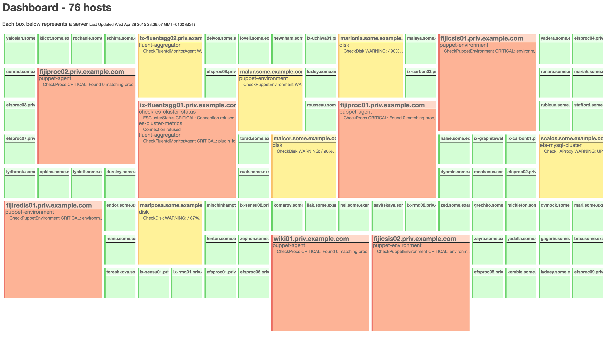

# Mosaic

Demo at - [warmfusion.co.uk/mosaic](http://warmfusion.co.uk/mosaic)

Screenshot:

## Integration with Sensu

The dashboard currently consumes an uchiwa dashboard endpoint (/get_sensu) to construct its representation
of the services and checks that are being run.

To use this integration, you either need to export (ie download) the get_sensu endpoint from your uchiwa dashboard
or add 'cors' headers to the get_sensu response such that your browser will allow the ajax calls to function properly.

Add `?url=<your_uchiwa_host>/get_sensu` to select where the dashboard will consume its data

## Testing

Run a test webserver and access it on http://localhost:9090

    ruby -run -e httpd . -p 9090
