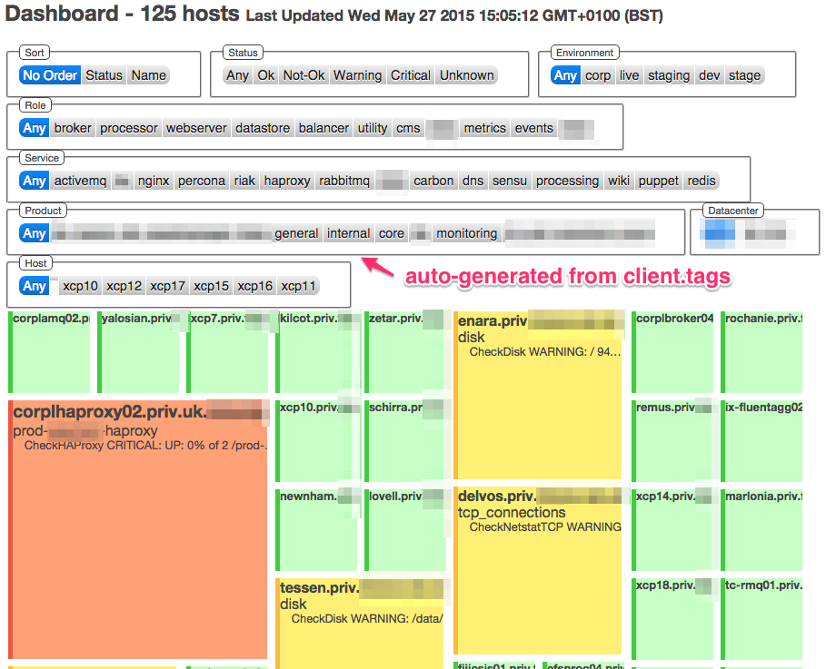

# Mosaic

Demo at - [warmfusion.co.uk/mosaic](http://warmfusion.co.uk/mosaic)

Screenshot:




## Integration with Sensu

The dashboard currently consumes an uchiwa dashboard endpoint (/get_sensu) to construct its representation
of the services and checks that are being run.

To use this integration, you either need to export (ie download) the get_sensu endpoint from your uchiwa dashboard
or add 'cors' headers to the get_sensu response such that your browser will allow the ajax calls to function properly.

Add `?url=<your_uchiwa_host>/get_sensu` to select where the dashboard will consume its data

### CORS header

Haproxy configuration to automatically create CORS headers for ANY incoming server is as shown below:

    capture request header origin len 128
    http-response add-header Access-Control-Allow-Origin %[capture.req.hdr(0)] if { capture.req.hdr(0) -m found }
    rspadd Access-Control-Allow-Headers:\ Origin,\ X-Requested-With,\ Content-Type,\ Accept  if { capture.req.hdr(0) -m found }


## Testing

Run a test webserver and access it on http://localhost:9090

    ruby -run -e httpd . -p 9090


# Extra Features

The buttons along the top are populated by looking for a 'tags' hash in each clients custom configuration.

This allows you to create filters of the servers based on any criteria you setup.

For example, by adding the following json to your sensu client.json file you'll get a new button bar for that servers favourite colour:

```
{
  "client": {
    ...
    "tags": {
      "colour": "taupe",
    }
  }
}
```